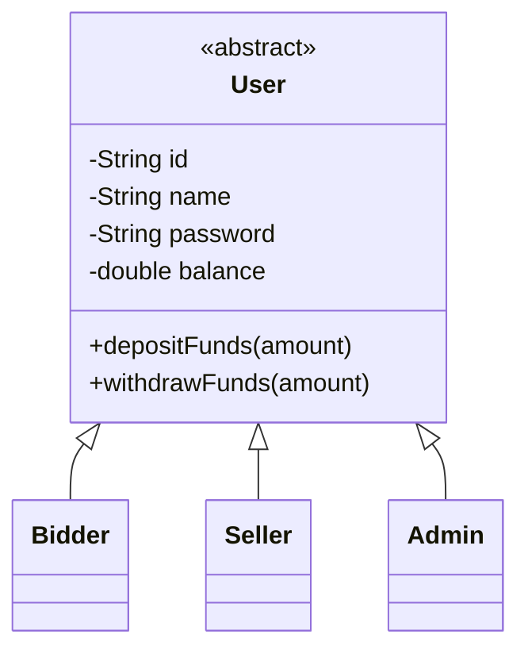
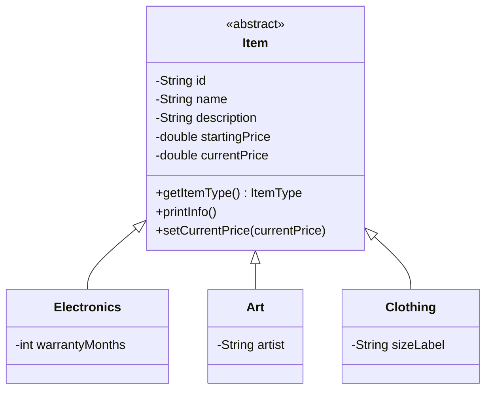
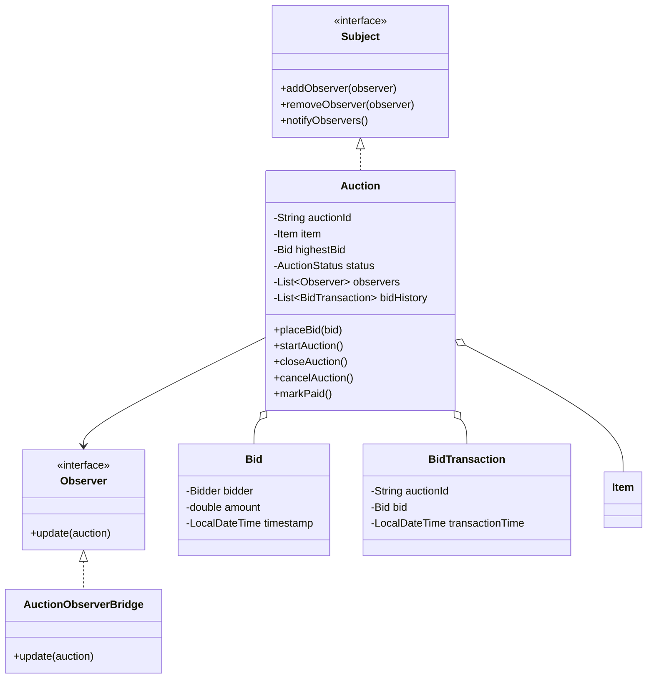
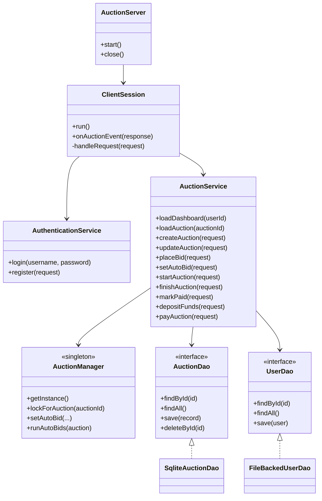

# Diagram và Design Pattern của dự án

Tài liệu này mô tả các lớp chính, quan hệ kế thừa, kiến trúc server-client và các design pattern đang được áp dụng trong hệ thống.

## 1. Diagram các lớp chính và quan hệ kế thừa

### 1.1. Model người dùng

`User` là lớp tổng quát vì tất cả tài khoản đều có `id`, `name`, `password` và `balance`. Các lớp con thể hiện vai trò cụ thể trong hệ thống:

- `Bidder`: đặt giá, nạp tiền và thanh toán phiên đấu giá đã thắng.
- `Seller`: tạo, sửa, xóa, bắt đầu và kết thúc các phiên đấu giá của mình.
- `Admin`: thực hiện thao tác quản trị như `markPaid`, `cancelAuction` và quản lý toàn bộ auction.

### 1.2. Model sản phẩm đấu giá

`Item` gom các trường và hành vi chung của một món hàng đấu giá. Mỗi loại hàng chỉ bổ sung phần thông tin riêng:

- `Electronics`: thời gian bảo hành theo tháng.
- `Art`: tên nghệ sĩ.
- `Clothing`: kích cỡ sản phẩm.

### 1.3. Auction, Bid và Observer

`Auction` là đối tượng trung tâm của nghiệp vụ đấu giá. Nó tự quản lý:

- Trạng thái phiên: `OPEN`, `RUNNING`, `FINISHED`, `PAID`, `CANCELED`.
- Giá hiện tại thông qua `Item.currentPrice`.
- Giá cao nhất thông qua `highestBid`.
- Lịch sử đặt giá thông qua `bidHistory`.
- Thông báo thay đổi qua `Subject.notifyObservers()`.

### 1.4. Server service, DAO và network

Server nhận kết nối từ nhiều client, tạo `ClientSession` cho từng kết nối, sau đó dispatch request đến `AuthenticationService` hoặc `AuctionService`. Tầng service không thao tác trực tiếp với database mà làm việc thông qua interface DAO.

## 2. Design pattern đang dùng và lý do

### 2.1. MVC / Presentation Separation

Áp dụng ở phía client:

- View: các file FXML như `LoginView.fxml`, `DashboardView.fxml`, `AuctionDetailView.fxml`.
- Controller: `LoginController`, `DashboardController`, `AuctionDetailController`, `SellerController`, `AccountController`.
- Model phía UI: `SessionModel` và các DTO như `AuctionView`, `DashboardView`, `UserView`.

Lý do sử dụng:

- Tách giao diện khỏi xử lý sự kiện.
- Controller chỉ điều phối: đọc input, gọi `AuctionClientService`, cập nhật UI.
- `SessionModel` giữ state hiện tại của màn hình, giúp danh sách auction và lịch sử bid có thể refresh theo response mới.

### 2.2. Singleton - `AuctionManager`

`AuctionManager.getInstance()` tạo một instance dùng chung trên toàn server.

Lý do sử dụng:

- Cần một nơi quản lý registry auction đang chạy, lock theo từng auction, session đang active và auto-bid rules.
- Nếu mỗi service hoặc session tạo `AuctionManager` riêng thì lock và auto-bid sẽ không đồng bộ, dễ xảy ra race condition.
- Singleton phù hợp vì đây là state điều phối ở phạm vi toàn server.

### 2.3. Observer - `Subject`, `Observer`, `Auction`, `AuctionObserverBridge`

`Auction` implements `Subject`. Khi có bid mới, start, close, cancel hoặc mark paid, `Auction` gọi `notifyObservers()`. `AuctionObserverBridge.update()` nhận sự kiện, lưu lại DAO và publish event realtime.

Lý do sử dụng:

- `Auction` không cần biết UI, socket hay database hoạt động ra sao.
- Logic domain chỉ cần báo rằng trạng thái đã thay đổi.
- Bridge chuyển thay đổi domain thành hành động hạ tầng: persist và push event cho client.

Điểm hay của pattern này là `Auction` không phụ thuộc vào socket hay DB. Nó chỉ notify; bridge và publisher tự xử lý phần còn lại.

### 2.4. Factory Method / Simple Factory - `ItemFactory`

`ItemFactory.createItem(type, ...)` tạo đúng subclass theo `ItemType`:

- `ELECTRONICS` -> `Electronics`
- `ART` -> `Art`
- `CLOTHING` -> `Clothing`

Lý do sử dụng:

- `AuctionService` không phải `new Electronics`, `new Art`, `new Clothing` ở nhiều nơi.
- Logic tạo item theo `ItemType` được tập trung vào một chỗ.
- Khi thêm loại item mới, chỉ cần thêm enum, class con và case trong factory.

### 2.5. DAO / Repository - `AuctionDao`, `UserDao`

`AuctionService` làm việc với interface `AuctionDao`, `UserDao`, không phụ thuộc trực tiếp vào SQLite hay file JSON.

Implementation hiện tại:

- `SqliteAuctionDao`: lưu auction và bid history vào SQLite.
- `FileBackedUserDao`: lưu user vào `users.json`.
- `InMemoryAuctionDao`, `InMemoryUserDao`: phù hợp cho test.

Lý do sử dụng:

- Tách nghiệp vụ khỏi persistence.
- Dễ thay đổi cách lưu trữ mà không sửa service.
- Test có thể dùng DAO in-memory, không cần database thật.

### 2.6. DTO và protocol object

Client và server truyền dữ liệu bằng:

- `ClientRequest<T>`: gồm `CommandType` và payload request.
- `ServerResponse<T>`: gồm status, message, payload và event type.
- DTO: `AuctionView`, `DashboardView`, `UserView`, `ItemView`, `BidView`.

Lý do sử dụng:

- Không gửi trực tiếp domain object đầy đủ cho UI.
- Giảm phụ thuộc giữa client và server.
- Response có thể phân biệt `SUCCESS`, `ERROR`, `EVENT`.

### 2.7. Command dispatch - `CommandType` và `ClientSession.handleRequest`

Mỗi thao tác client được biểu diễn bằng một command:

- `LOGIN`, `REGISTER`, `LOAD_DASHBOARD`
- `PLACE_BID`, `SET_AUTO_BID`
- `CREATE_AUCTION`, `START_AUCTION`, `PAY_AUCTION`

`ClientSession.handleRequest()` switch theo `CommandType` và gọi đúng handler.

Lý do sử dụng:

- Một socket có thể phục vụ nhiều loại request.
- Dễ đọc luồng điều phối: command nào gọi service nào.
- Khi thêm chức năng mới, chỉ cần thêm `CommandType`, request class và handler tương ứng.

### 2.8. Mapper - `AuctionViewMapper`

`AuctionViewMapper` chuyển domain object như `ManagedAuction`, `Auction`, `User` thành DTO view.

Lý do sử dụng:

- Tách domain khỏi dữ liệu hiển thị.
- Client nhận dữ liệu gọn, serializable và dùng trực tiếp cho UI.
- Tránh lặp code mapping trong nhiều service method.

